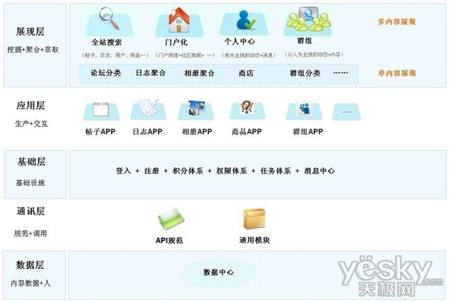
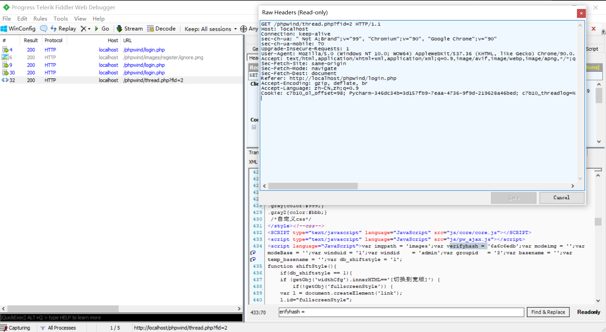
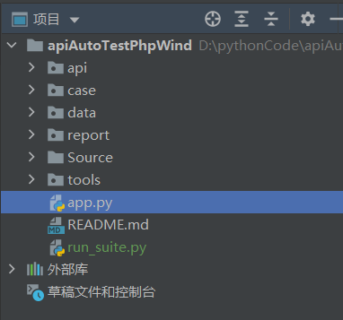

# 接口自动化框架搭建

熟悉接口自动化测试的流程

1. 接口自动化测试的流程
   1. 需求分析
   2. 挑选需要做自动化测试的功能
   3. 设计测试用例
   4. 搭建自动化测试环境
   5. 设计自动化测试项目的框架
   6. 编写代码
   7. 执行测试用例
   8. 生成测试报告并分析结果

### 项目接口介绍

##### 项目介绍

PhpWind开源

##### 项目描述

phpwind（简称：pw）是一个基于PHP和MySQL的开源社区程序，是国内最受欢迎的通用型论坛程序之一。phpwind第一个版本ofstar发布于2004年。截止2013年12月phpwind项目品牌由[阿里云计算有限公司](https://baike.baidu.com/item/阿里云计算有限公司/9290475)拥有，软件全面开源免费。现已有累积超过100万的网站采用phpwind产品，其中活跃网站近10万。自2011年发布PHPWind8.x系列版本以来，phpwind围绕着提升社区内容价值和推进[社区电子商务](https://baike.baidu.com/item/社区电子商务/8233360)两个大方向，开发单核心多模式的产品，实现新型的社区形态。2012年筹备发布的phpwind9.0将采用phpwind自主研发的Windframework框架并整合基于阿里云云计算架构的社区[云平台](https://baike.baidu.com/item/云平台)应用中心，将为未来的社区提供更丰富多样的解决方案。

引用:[[PHPWIND_百度百科 (baidu.com)](https://baike.baidu.com/item/PHPWIND/1583960?fr=aladdin)]:

##### 技术架构图:



### 项目接口分析

分析接口文档...

### 挑选需要做接口测试的功能

### 用例设计

#### 目标

编写自动化测试用例文档

1.单接口的用例设计



### 项目搭建

#### 目标

了解如何进行自动化测试框架的搭建

##### 1.新建项目

项目名称:apiAutoTestPhpWind

##### 2.创建目录结构



3.安装依赖包

```bash
pip install requests
pip install pyyaml
```

### 代码编写

#### 目标

1. 掌握如何封装项目中的接口
2. 掌握如何使用UnitTest管理项目中的测试用例

1. 封装接口类

   根据用例分析待测功能,按功能模块定义接口类

   ```python
   登录:login.py
   默认板块:channel.py
   发帖:article.py
   回帖:reply.py
   ```

2. 编写测试脚本

   1. 定义测试脚本文件

      ```python
      登录模块:test_login.py
      默认板块:test_channel.py
      发帖模块:test_article.py
      回帖模块:test_reply.py
      ```

   2. 使用unittest管理测试脚本

3. yaml处理接口依赖公用数据

   ```python
   import yaml
   
   
   class ReadExtract:
       def read_extract(self):
           with open('../tools/extract.yaml', encoding='utf-8') as f:
               result = yaml.load(stream=f, Loader=yaml.FullLoader)
               # dict对象
               return result
   
       def write_extract(self, data):
           with open('../tools/extract.yaml', encoding='utf-8', mode='w') as f:
               yaml.dump(data, stream=f, allow_unicode=True)
   
   ```

4. 执行测试脚本

   1. 使用unittest
   2. 调试代码

5. 数据库数据校验

   1. 用例场景

      调用发帖功能的接口后,校验数据库中是否插入了对应的收藏记录.

   2. 表结构

   3. 示例代码

6. 封装数据库操作工具类

   为了减少代码的冗余,提高测试效率,可以对数据库的相关操作封装成工具类

   示例代码

#### 数据驱动

##### 目标

利用数据驱动应用到项目中

1. 数据驱动

   1. 定义数据文件

      1. 定义存放测试数据的目录,目录名称:data

      2. 分模块定义数据文件

         ```
         登录模块:login.json
         频道模块:channel.json
         发帖模块:article.json
         回帖模块:reply.json
         ```

      3. 根据业务编写用例数据

   2. 测试数据参数化

      修改测试脚本,使用parameterized实现参数化

### 生成测试报告

#### 目标

掌握如何使用UnitTest生成测试报告

##### 1.生成测试报告

使用HTMLTestRunner生成测试报告

```python
report_file = "./report/report{}.html".format(time.strftime("%Y%m%d-%H%M%S"))
with open(report_file,"wb") as f:
	runner = HTMLTestRunner(f, title="PHPWIND接口自动化测试报告", description="V1.0");
	runner.run(suite)
```

##### 2.分析测试结果

